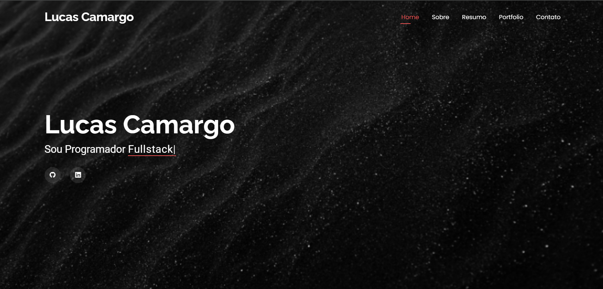

# Portfólio de Lucas Camargo

Este repositório contém o portfólio online de Lucas Camargo, um programador com experiência em Front-end, Back-end e desenvolvimento Fullstack. O site é desenvolvido com HTML, CSS e JavaScript, utilizando uma estrutura responsiva e moderna.

## Acesse o Portfólio

Você pode acessar o portfólio online através do seguinte link: [Portfólio de Lucas Camargo](https://lcamargodasilva.github.io/portfolio/)

## Imagem do Projeto

Aqui está uma prévia visual do projeto:

## Visão Geral

O portfólio inclui as seguintes seções:
- **Home**: Página inicial com uma breve introdução.
- **Sobre**: Informações pessoais e detalhes sobre a carreira.
- **Resumo**: Resumo profissional e acadêmico.
- **Portfólio**: Exibição de projetos e realizações.
- **Contato**: Informações de contato e redes sociais.

## Estrutura do Projeto

O projeto é composto pelos seguintes arquivos e diretórios principais:

- `index.html`: Página inicial do portfólio.
- `sobre.html`: Página com informações pessoais.
- `resumo.html`: Página com o resumo profissional.
- `portfolio.html`: Página que exibe os projetos realizados.
- `contato.html`: Página com as informações de contato.
- `assets/`: Diretório contendo imagens, ícones e estilos.
  - `img/`: Imagens utilizadas no site.
  - `vendor/`: Bibliotecas e frameworks externos.
  - `css/`: Arquivos de estilos personalizados.
  - `js/`: Scripts JavaScript.
- `styles.css`: Arquivo principal de estilos do site.
- `scripts.js`: Arquivo JavaScript para funcionalidades do site.

## Tecnologias Utilizadas

- **HTML5**: Estruturação do conteúdo.
- **CSS3**: Estilização e layout do site.
- **JavaScript**: Funcionalidades interativas.
- **Bootstrap**: Framework CSS para design responsivo.
- **AOS**: Biblioteca para animações ao rolar a página.
